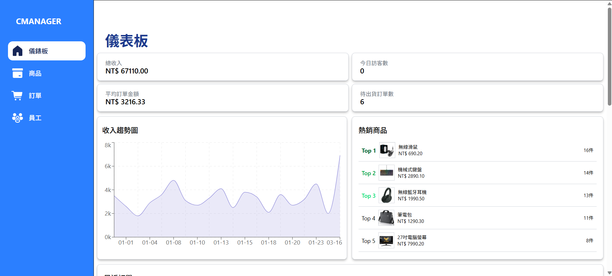
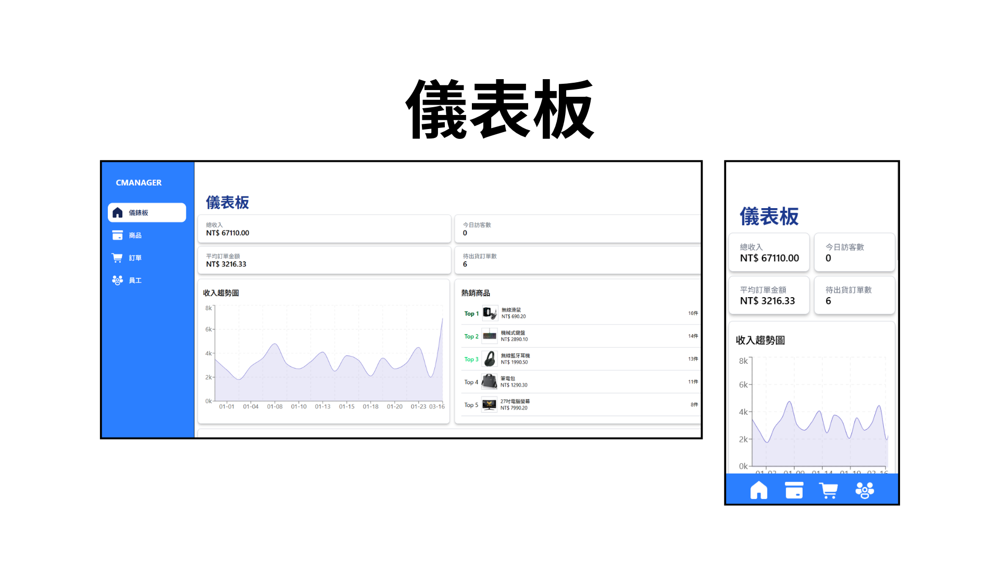
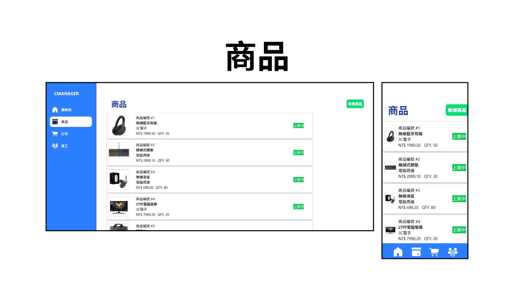
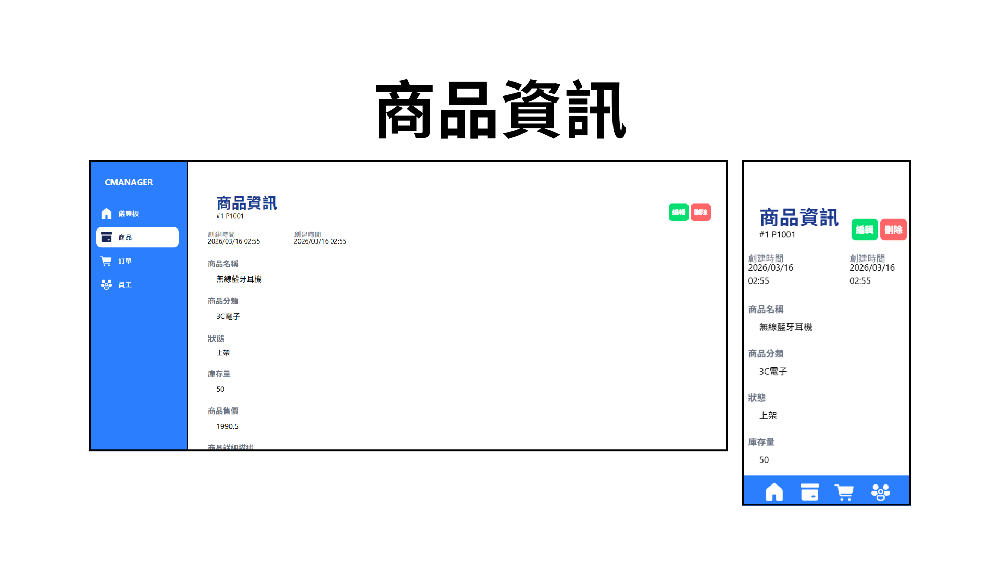
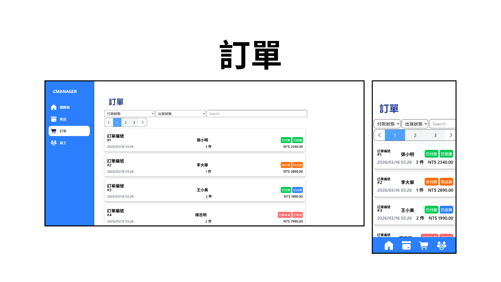
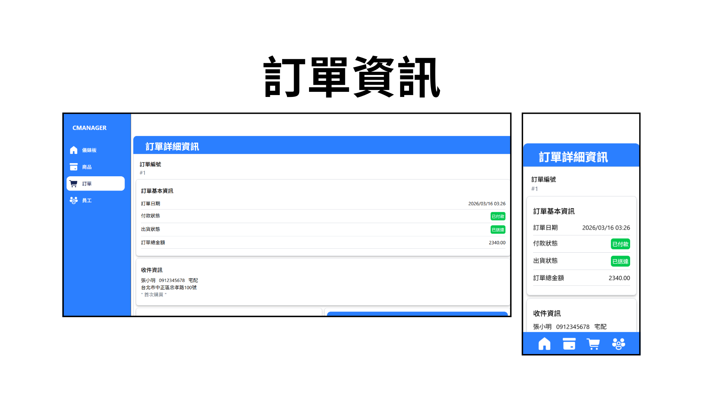
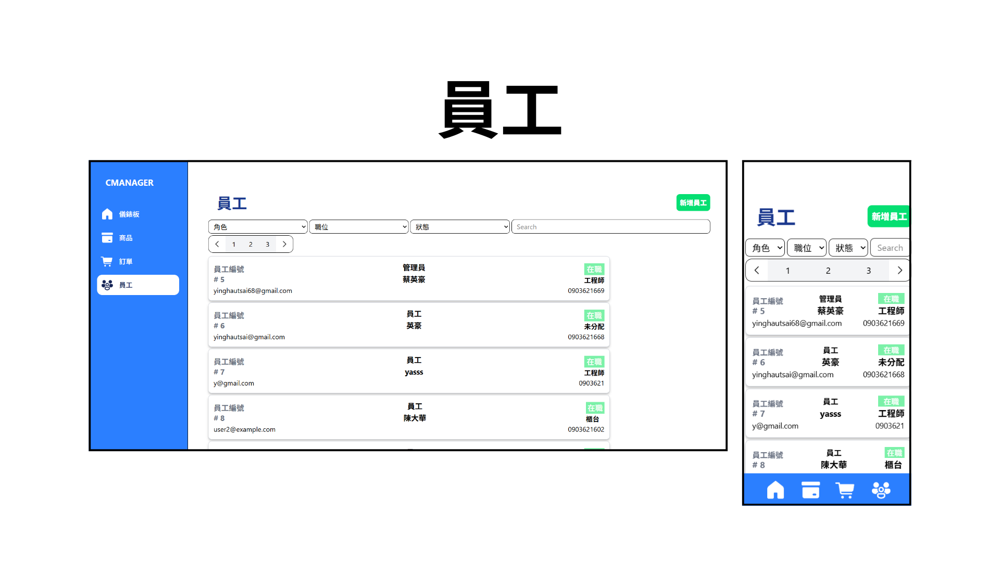

# CommerceManager
## 全端儀錶板
### DEMO連結

### 專案介紹
這個專案是ECommerce的後端儀表板。平台中，管理員可以透過KPI、表以及其他顯示資料的工具。可以簡單查詢店的經營表現，除了此之外，也可以透過平台管理店內的
所有商品、訂單以及員工。如果以管理員帳號登入平台，則會收到完正授權，授權包括：讀取、新增、更正以及刪除資料。

### 技術棧
前端：
- React.js
- TypeScript
- React Router
- Tailwind CSS
- RWD
- Figma
- HTML
- CSS
- JavaScript

後端：
- Node.js
- TypeScript
- Express.js
- MySQL
- MongoDB
- RESTful API
- Multer.js
- AWS S3
- AWS RDS
- Cloundinary

## 展示
### 儀表膽

### 商品

### 商品資訊

### 訂單

### 訂單資訊

### 員工

### 員工資訊

